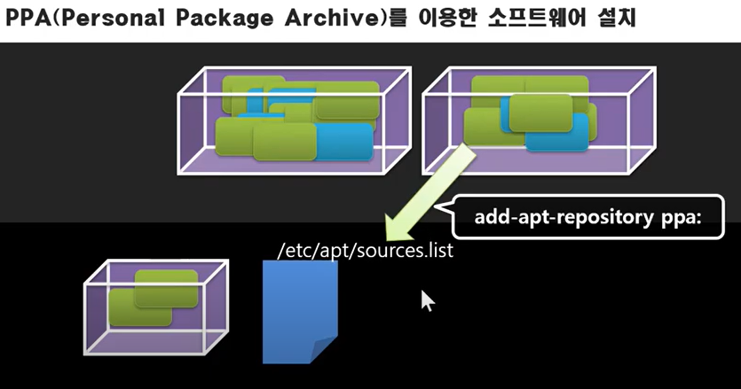

# 리눅스 강의 38강. 향상된 패키지 관리도구(APT)를 이용한 JDK 설치

## S/W 설치 with APT(Advanced Packaging Tool)

```shell
/etc/apt/sources.list # 많은 주소들이 있다.
```

- 저장소 주소를 목록에 추가 후 `apt-get update` 한 번 하면 된다.

- 만약 update가 잘 안되는 것 같다면?

  - `apt-get dist-update` 의존성 검사를 통해 목록을 갱신한다.

- (저장소 안에 있는) (설치할 수 있는) 패키지 목록을 캐시化한다. 

  - `apt-cache search X` : 캐시를 검색해서 X가 있는지 확인한다.
  - `apt-cache show X` : X의 정보를 자세히 본다.

- ```shell
  apt-get install X
  ```

- ```shell
  apt-get remove X # 실행파일만 삭제한다. 
  apt-get purge X # 설정파일도 삭제한다.
  ```

### <실습> APT 이용하여 JDK 설치하기

- ```shell
  apt-cache ~ # 패키지에 대한 정보를 저장하고 있는 명령어
  apt-cache pkgnames
  apt-cache pkgnames | less
  apt-cache search jdk # jdk 들어간 것 찾아라
  apt-cache search jdk | grep jdk # jdk 를 highlight
  apt-cache pkgnames | grep jdk # jdk 들어간 목록 찾아라
  ```


-  ```shell
  sudo apt-get install openjdk-11-jdk # 설치
  ```

### whereis 명령어

- ```shell
  whereis java # 이 시스템에서, 자바라는 명령어를 사용할 수 있는 곳 목록을 출력한다.
  ```

다음시간... 선택적으로 JDK 사용하는 방법을 알아본다. 

# 리눅스 강의 39강. PPA와 update-java-alternatives를 이용한 JDK 설치하기

## PPA(Personal Package Archive)를 이용한 S/W 설치

- APT는, Canonical이 제공하는 저장소만 쓸 수 있는 건 아니다.

- 개인화된 저장소 주소를 `/etc/apt/sources.list` 에 등록하고
  
  
  - `add-apt-repository ppa:` (추가하고)
  - `apt-get update` (업데이트한다=위에 추가한 것의 패키지 목록을 확인한다.)
  
- `jdk-8` 버전을 갖고 있는 / PPA 주소(개인들이 관리하는 저장소) 를 찾아본다.

  - 검색어 : openjdk ppa ubuntu 구글링한다. 

  - launchpad... 에서 찾을 수 있다. 

  - 

  - 주소를 복사해서 사용한다. → 이 주소가 source.list 에 추가된다.

  - ```shell
    sudo add-apt-repository ppa:openjdk-r/ppa
    sudo apt-get update
    ```

  - ```shell
    sudo apt-get install openjdk-8-jdk
    ```

  - `apt-xxx` 를 `apt` 로 줄여서 쓸 수 있는 경우도 있다.  (명령어 옵션 찾아보기)
### update-java-alternatives

  ```shell
  update-java-alternatives -l
  sudo update-java-alternatives -s java-1.8.0 # 정확한 이름은 tab 해서 찾기
  java -version # 해보면 바뀐 것을 볼 수 있다.
  ```

# 40강. 링크 관리도구 update-alternatives와 java-alternatives

#### intro

- 현재 경로에 `test.sh` 파일이 있을 때 `test.sh` 입력하면 실행될까?
  - 안 된다. 경로를 써야 한다. 
  - `./test.sh`
- 경로를 쓰지 않고 실행하려면? 두 가지 방법이 있다.

1. $PATH 에 경로를 등록한다. 혹은 기등록 경로에 링크파일을 둔다.

   ```shell
   ln -s ~/test.sh ~/bin/bb
   ```

### 링크 사용 순서를 관리해주는 alternatives 도구

- 직접 링크파일을 만드는 것보다 편한다. 

```shell
sudo update-altervatives --config editor # nano랑 vi 선택 예시
```


```shell
sudo update-alternatives --install ~/bin/bb bb ~/test1.sh 1
sudo update-alternatives --install ~/bin/bb bb ~/test2.sh 2
```

##### 인자(순서대로)

- `~/bin/bb` : 이 디렉토리에 `bb` 라는 이름으로 심볼릭 링크를 만든다.
- `bb` : config 시 이 이름으로 사용하겠다.
- 실제 파일의 위치를 지정한다.
- 우선순위


##### config 변경하기 (install 시 bb라는 이름으로 설정하여 놓았음)

```shell
sudo update-alternatives --config bb 
```


```shell
update-alternatives --all
```


- jdk 가 설치되면서... java 버전의 alternatives 를 만듦
- 이것을 사용하면 링크파일이 한번에 교체된다.
  - `update-alternatives` 로 일일이 교체할 필요 없다. 

```
update-java-alternatives
```

