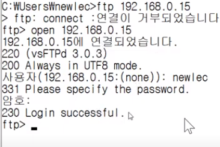

# 리눅스 강의 41강. 텔넷(telnet) 서비스 사용하기

1. 텔넷 데몬(서비스, 서버프로그램) 설치하기 (서버 프로그램)

   ```
   apt search telnetd
   sudo apt telenetd
   dpkg -s telnetd
   ```

2. 텔넷 클라이언트 설치하기

   1. 제어판 > 프로그램 제거 또는 변경 > Windows 기능 켜기/끄기 > 텔넷 클라이언트 체크

3. `ifconfig` : 리눅스의 IP 확인하는 명령어

4. IP

   1. 공인IP
   2. 사설IP : 공유기 내 네트워크 안에서만 사용하는 식별자 

5. DOS창 

   ```shell
   telnet <localhost>
   ```

   ```shell
   telnet 192.168.~ # <호스트 컴퓨터>
   ```

   c.f. 버추얼박스 > 설정 > 네트워크 > 고급 : `Port Forwarding` 규칙 설정한다. 
   : 사설 IP (192.168.~~) 접속 시 리눅스 VM으로 연결되도록

   공유기에도 Port Forwarding 기능 있다.

   

6. 보안 상의 문제로 telnet 은 잘 사용하지 않는다. 대안 : ssh

# 리눅스 강의 42강. 텔넷(telnet) 서비스의 취약점, IP Spoofing, DNS poisoning, SSH

## Telnet 대신 SSH(Secure Shell)을 사용하는 이유

- IP spoofing
  - 송신자가 패킷 위조할 수 있다. But 수신자는 확인할 수 없다.
  - 수신자 입장 : 누가 보낸 것인지 확인하고 싶다.
- DNS poisoning
  - 도스창에 `ipconfig` : `DNS 서버` 의 IP 
    - 여기에 도메인 보내면? 대신 IP를 물어봐주고 알려준다.
  - 주소를 cache화한다. (학습한다. 기억한다. 일정 시간 동안)
  - (DNS서버가 먼저 물어보지 않았는데) 거짓정보를 DNS 서버에 보내면? 
    - 거짓정보임에도 학습한다. 

## Telnet 보다 안전한 SSH - SSH 구현 방식

- 첫 연결 시 | 키를 나누어 가진다. 
  - 이 키로 모든 메세지를 암호화한다.

# 리눅스 강의 43강. SSH 서버 설치와 putty 다운로드 및 접속하기

## SSH 서버 설치하기

- 서버 목록 확인하기

  ```shell
  service --status-all
  ```

- 자세히 보기

  ```shell
  service ssh status
  ```

- 설치가 이미 되어 있다.

  ```shell
  sudo apt-get install openssh-server
  ```

- `ssh`는 22번 포트를 사용한다.  (포트 포워딩 등록한다. )

   ```shell
   # SSH 재시작하기
   sudo /etc/init.d/ssh restart
   ```
   
- SSH는 Telnet과 달리 클라이언트가 기본 설치되어 있지 않다. Putty를 설치한다. (키를 나눠갖게 해준다.)

# 리눅스 강의 44강. FTP 서버와 SSH FTP 서버 설치 그리고 파일 전송

## ftp 서비스 (서버) 설치하기 

- ```shell
	sudo apt-get install vsftpd
	```
	
- 제대로 설치되었나 확인한다.

  ```
  service --status-all
  
  ...
  
  [+] vsftpd
  ```

- `vsftpd` 의 상태보기

  ```shell
  service vsftpd status
  ```

- ftp 클라이언트는 기본 설치되어 있다. 

- ftp 서버 포트포워딩 해준다 (21번 포트)

  ```
  ftp <ip주소> 
  ```

-  

- `help` : `ftp` 명령어 검색

- ```shell
  ftp> get test.txt
  ```

- 요샌 ftp 잘 안쓰고 22번포트로(ssh) 파일도 주고받을 수 있다.

