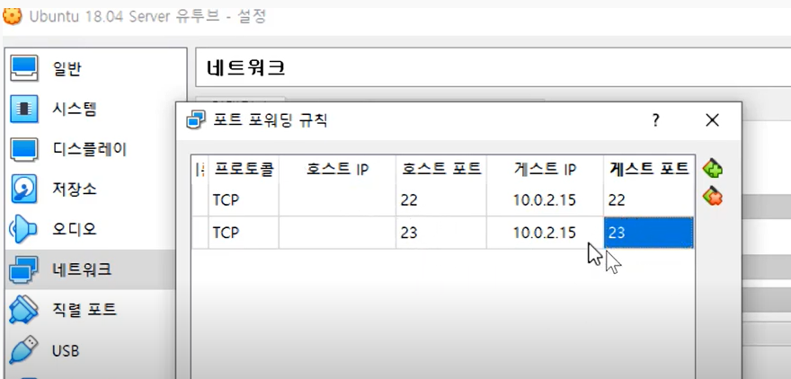

# 리눅스 강의 41강. 텔넷(telnet) 서비스 사용하기

1. 텔넷 데몬(서비스, 서버프로그램) 설치하기

   ```
   apt search telnetd
   sudo apt telenetd
   dpkg -s telnetd
   ```

2. 제어판 > Windows 기능 켜기/끄기 -> 텔넷 클라이언트 체크

3. DOS창 

   ```
   telnet <localhost>
   ```
   
   c.f. 버추얼박스 > 설정 > 네트워크 > 고급 : 포트 포워딩 규칙 설정한다. 
   

W


