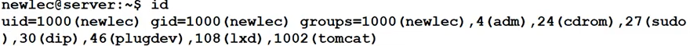

# 리눅스 강의 45강. 이동형 USB 저장장치 마운트하기

- ```shell
  lsblk # 파티션 목록 확인 명령어
  ```

- 루트 디렉토리(`/`) 의 `media` 에 연결하여 사용한다.

- ```shell
  sudo mkdir usb
  ```

- 파티션을 `usb` 디렉토리에 연결한다.

  - 사전작업

    ```shell
    # 파티션 정보는 /dev 에서 확인할 수 있다.
    ls -l sd* # 이름으로 검색 
    # brw-rw---- 1 ~
    # => b : block device file 을 뜻한다.
    ```

  - ```shell
    sudo mount /dev/sdb1 /media/usb # 연결한다. 
    ```
    
  - ```shell
    ls -l /media/usb # 목록 나온다. 
    ```

- 실제 기기를 제거했음에도 (가상머신에) 목록이 계속 남아 있다. (재시작하면 사라진다.)

- 연결 해제하기

  ```shell
  sudo umount /media/usb 
  ```

# 리눅스 강의 46강. 톰캣 9.0 서버 설치하기

- 웹서비스 운영을 위한 톰캣 서버 설치 실습

- 설치 가능한 톰캣이 있는지 알아본다. → 8.0은 있고 9.0은 없다. 

  ```shell
  apt-cache search tomcat | grep tomcat 
  ```

- `tomcat.apache.org` 사이트 > Download > Tomcat 9.0 

  - `tar.gz` 다운로드 → 리눅스 서버로 옮긴다.

  - 압축 해제한다.

    ```shell
    tar -zxvf apache-tomcat-9.0.14.tar.gz
    ```

  - 디렉토리를 변경한다.

    ```shell
    sudo mv ~/download/apache-tomcat-9.0.14/ tomcat/
    ```

  - 확인한다. (`w3m` 설치하여 이용)

    ```shell
    sudo apt install w3m
    w3m http://localhost:8080
    ```

  - 프로세스 확인하기

    ```shell
    ps -ef | grep tomcat
    ```

- 톰캣을 끄고 킬 때 경로 전체를 입력한다.

  ```shell
  /usr/local/tomcat/apache-tomcat-9.0.14/bin/startup.sh
  /usr/local/tomcat/apache-tomcat-9.0.14/bin/shutdown.sh
  ```

# 리눅스 강의 47강. 톰캣 서비스를 위한 사용자 그룹 설정하기

- 유저 확인하기

  ```shell
  id <유저이름>
  ```

- ```shell
  sudo groupadd tomcat # 그룹을 만들고
  sudo usermod -a -G tomcat newlec # tomcat 그룹에 newlec 사용자를 추가
  sudo usermod -a -G tomcat dragon # tomcat 그룹에 dragon 사용자를 추가
  ```

  

  - `newlec` 유저도 1002(tomcat) 그룹에 포함된 것을 확인
  - tomcat 그룹에 포함된 유저들은 tomcat 을 실행할 수 있도록 하고 싶다.

- `???>>>apache-tomcat-~` 디렉토리의 소유그룹을 tomcat 으로 변경한다. 

  ```shell
  sudo chown -R root:tomcat apache-tomcat-9.0.14/
  ```

- `sudo` 그룹에 포함된 id 로 로그인하여... `etc/environment` 를 수정한다. 

# 리눅스 강의 48강. 톰캣 80번 포트 사용할 수 있게 하기(authbind)

- `/conf/~` 디렉토리의 `server.xml` 파일을 수정한다.

- 네트워크 옵션 수정

  - 1024번 이하의 포트는 관리자만 사용할 수 있다.
  - 그래서 관리자가 아닌 일반적인 유저, 프로그램이 사용하려면?
    - 권한을 인증받아야 한다.

- solution

  - `authbind` 유틸리티를 사용한다. -> tomcat 사용자가 실행하는 프로그램이 80번 포트를 사용가능하도록 설정한다.

  - ```shell
    # authbind 설치하기
    sudo apt install authbind
    ```

  - ```shell
    cd /etc/authbind/
    ```

  - ```shell
    sudo touch 80
    sudo chmod 550 80 # 읽거나 실행 권한
    ls -l
    ```

  - ```shell
    sudo chown root:tomcat 80
    ```

c.f. `exec authbind xxxx` : authbind 를 통해 실행해라 -> 80번 포트를 사용할 수 있게 된다. 

- `cd/usr/local/tomcat/~/bin/startup.sh` 를 editor 로 수정한다. 

  - 쭉 내려가서 exec 을 수정한다.

    ```shell
    exec authbind --deep ~ # --deep 옵션 : tomcat 의 자식 프로세스도 바인딩하도록 
    ```


